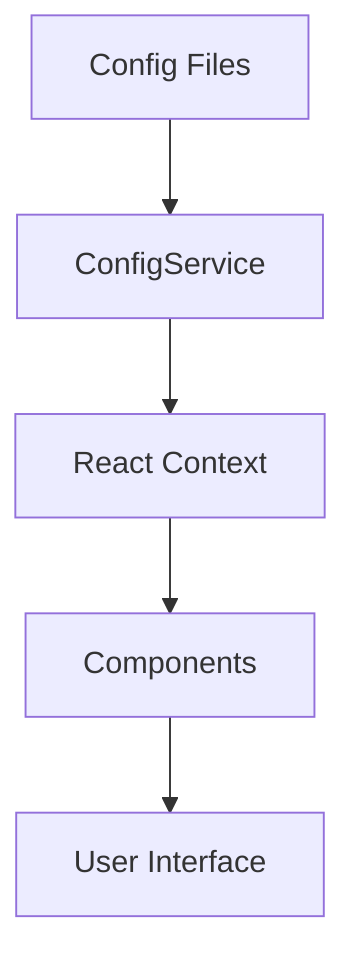
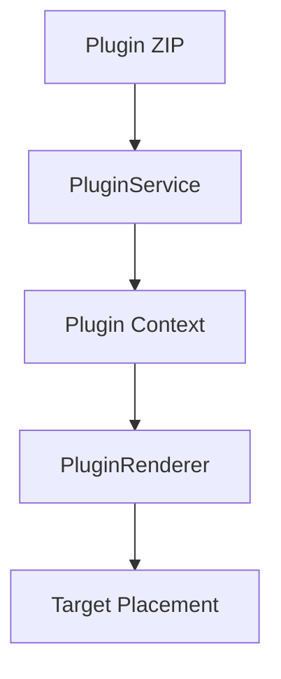
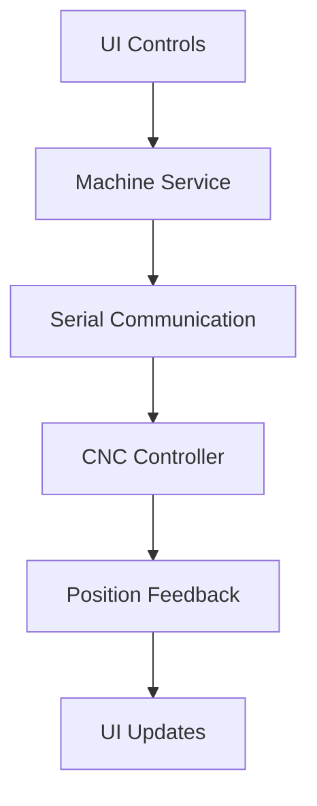

# Architecture Overview

CNC Jog Controls follows a **self-contained module architecture** designed for maintainability, testability, and clear separation of concerns.

## Core Principles

### Self-Contained Modules
Each functional domain is organized as a complete module with all related files in one location:

```
src/core/machine/
├── __tests__/          # Module-specific tests
├── __mocks__/          # Mock data for testing  
├── README.md           # Module documentation
├── config.ts           # Module configuration
├── index.ts            # Public API exports
└── MachineController.ts # Main implementation
```

### Responsibility Clusters

**Core** - Machine control functionality and business logic
- `machine/` - Machine state and control
- `positioning/` - Position tracking and jog controls
- `workspace/` - Working area and dimensions
- `visualization/` - 3D/2D rendering logic

**Services** - Cross-module services and state management
- `plugin/` - Plugin management service
- `config/` - Configuration management
- `state/` - Application state management

**UI** - User interface components organized by feature
- `controls/` - Jog control components
- `visualization/` - Visualization components
- `plugin/` - Plugin UI components
- `shared/` - Shared UI components

**Views** - Application screens and routing
- `Dashboard/` - Main dashboard
- `Controls/` - CNC controls interface
- `Plugins/` - Plugin management
- `Settings/` - Application settings

## Technology Stack

### Frontend
- **React 18** - UI framework with hooks and context
- **TypeScript** - Type safety and developer experience
- **Ant Design** - Professional UI component library
- **React Router** - Client-side routing

### 3D Visualization
- **Three.js** - 3D graphics and rendering
- **React Three Fiber** - React integration for Three.js
- **@react-three/drei** - Useful helpers and abstractions

### Desktop Integration
- **Electron** - Cross-platform desktop application
- **Vite** - Fast build tool and development server
- **Electron Builder** - Application packaging and distribution

### Testing
- **Jest** - Unit testing framework
- **React Testing Library** - Component testing utilities
- **Playwright** - End-to-end testing

## Data Flow

### Configuration Management


### Plugin System


### Machine Control


## Module Independence

### Strict Boundaries
- Modules only import from `services/` or `utils/`
- No direct cross-module dependencies
- Clear public APIs via `index.ts` exports
- Dependency injection for testability

### Configuration Separation
- Module-specific config in `config.ts`
- No hardcoded values in logic files
- Environment-based configuration
- Runtime configuration updates

### Testing Strategy
- Tests co-located with implementation
- Module-level mocks in `__mocks__/`
- Integration tests for service interactions
- E2E tests for critical user workflows

## Architecture Enforcement

### File Organization Rules
- **500 lines maximum** per file
- **Single responsibility** per module
- **Self-contained** functionality
- **Clear documentation** in README.md

### Import Discipline
```typescript
// ✅ Allowed imports
import { ConfigService } from '@/services/config';
import { formatCoordinate } from '@/utils/formatters';

// ❌ Forbidden cross-module imports  
import { MachineController } from '@/core/machine/MachineController';
```

### Public API Design
```typescript
// core/machine/index.ts
export { MachineController } from './MachineController';
export type { MachineState, MachineConfig } from './types';
export { createMachine } from './factory';
```

## Performance Considerations

### Bundle Optimization
- Code splitting by route and feature
- Lazy loading for plugin components
- Tree shaking for unused code
- Asset optimization

### 3D Rendering
- Level-of-detail (LOD) for complex models
- Efficient update cycles
- Memory management for scenes
- WebGL context optimization

### State Management
- Selective re-rendering with React.memo
- Optimized context providers
- Debounced updates for high-frequency data
- Local state for UI-only concerns

## Security

### Plugin Sandboxing
- Controlled API access
- Permission-based functionality
- Input validation and sanitization
- Secure plugin loading

### Data Protection
- No sensitive data in logs
- Secure configuration storage
- Input validation throughout
- Safe serial communication