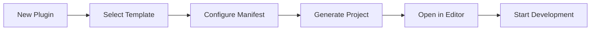
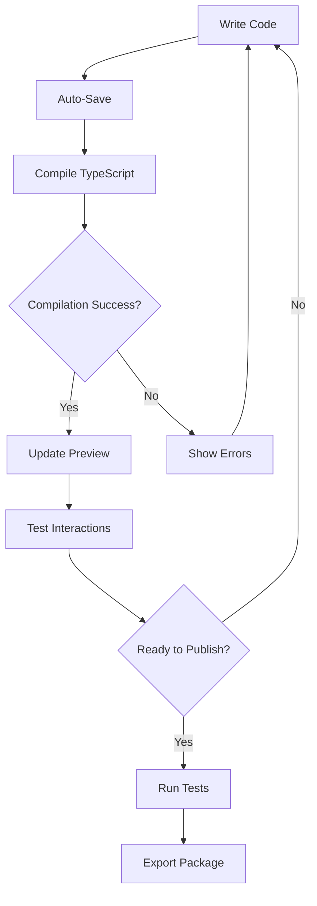

# Plugin Development Screen Implementation Plan

## Executive Summary

This document outlines the implementation plan for integrating a Plugin Development Screen into the CNC Electron application. This screen will provide developers with an integrated development environment (IDE) for creating, testing, and deploying plugins without leaving the main application.

## Table of Contents

1. [Overview](#overview)
2. [Architecture](#architecture)
3. [Core Components](#core-components)
4. [Technical Implementation](#technical-implementation)
5. [User Interface Design](#user-interface-design)
6. [Development Workflow](#development-workflow)
7. [Implementation Roadmap](#implementation-roadmap)
8. [Security Considerations](#security-considerations)

## Overview

### Goals
- **Integrated Development**: Complete plugin development within the main application
- **Real-time Preview**: Live preview of plugins in their actual placement context
- **TypeScript Support**: Full IntelliSense and type checking with `@cnc/plugin-types`
- **Hot Reload**: Instant feedback on code changes without manual compilation
- **Export to Registry**: Seamless packaging and submission to plugin registry

### Key Features
1. **Monaco Editor Integration**: VSCode-like editing experience
2. **Live Preview Panel**: Real-time plugin rendering with mock data
3. **Project Management**: Create, open, and manage plugin projects
4. **Integrated Testing**: Run tests within the development environment
5. **One-click Publishing**: Direct export to plugin registry

## Architecture

### High-Level Architecture

```
┌─────────────────────────────────────────────────────────────┐
│                    Plugin Development Screen                  │
├─────────────────┬──────────────────┬────────────────────────┤
│  Project Panel  │   Code Editor    │    Preview Panel       │
│                 │                  │                        │
│  • File Tree    │  • Monaco Editor │  • Live Preview       │
│  • Templates    │  • Syntax        │  • Mock API Data      │
│  • Actions      │    Highlighting  │  • Error Display      │
│                 │  • IntelliSense  │  • Console Output     │
└─────────────────┴──────────────────┴────────────────────────┘
                            │
                  ┌─────────┴─────────┐
                  │  Core Services    │
                  ├─────────────────────┤
                  │ • Compiler Service │
                  │ • File Watcher    │
                  │ • Mock API        │
                  │ • Validation      │
                  └───────────────────┘
```

### Component Structure

```
src/
├── views/
│   └── PluginDevelopment/
│       ├── PluginDevelopmentView.tsx    # Main container
│       ├── components/
│       │   ├── ProjectPanel/             # Project management
│       │   │   ├── FileTree.tsx          # File explorer
│       │   │   ├── ProjectActions.tsx    # New/Open/Save
│       │   │   └── TemplateSelector.tsx  # Plugin templates
│       │   ├── CodeEditor/               # Code editing
│       │   │   ├── MonacoEditor.tsx      # Editor wrapper
│       │   │   ├── EditorToolbar.tsx     # Format/Save/Run
│       │   │   └── EditorTabs.tsx        # Multi-file tabs
│       │   ├── PreviewPanel/             # Live preview
│       │   │   ├── PluginPreview.tsx     # Render component
│       │   │   ├── PreviewControls.tsx   # Placement selector
│       │   │   └── MockDataProvider.tsx  # Mock API data
│       │   └── DevConsole/               # Development tools
│       │       ├── ConsoleOutput.tsx     # Log display
│       │       ├── ErrorDisplay.tsx      # Error messages
│       │       └── TestRunner.tsx        # Test execution
│       └── services/
│           ├── PluginCompiler.ts         # TypeScript compiler
│           ├── FileWatcher.ts            # Hot reload service
│           ├── MockPluginAPI.ts          # Simulated API
│           └── PluginValidator.ts        # Manifest validation
```

## Core Components

### 1. Monaco Editor Integration

```typescript
interface EditorConfig {
  language: 'typescript' | 'javascript' | 'json' | 'css';
  theme: 'vs-dark' | 'vs-light';
  options: {
    minimap: { enabled: boolean };
    fontSize: number;
    tabSize: number;
    formatOnSave: boolean;
    autoSave: boolean;
  };
}

// MonacoEditor.tsx
import * as monaco from 'monaco-editor';
import { useEffect, useRef } from 'react';

export const MonacoEditor: React.FC<EditorProps> = ({ 
  value, 
  onChange, 
  language, 
  options 
}) => {
  const editorRef = useRef<monaco.editor.IStandaloneCodeEditor>();
  
  useEffect(() => {
    // Configure TypeScript compiler options
    monaco.languages.typescript.typescriptDefaults.setCompilerOptions({
      target: monaco.languages.typescript.ScriptTarget.ES2020,
      jsx: monaco.languages.typescript.JsxEmit.React,
      moduleResolution: monaco.languages.typescript.ModuleResolutionKind.NodeJs,
      lib: ['es2020', 'dom'],
      allowSyntheticDefaultImports: true,
      esModuleInterop: true
    });
    
    // Add @cnc/plugin-types definitions
    monaco.languages.typescript.typescriptDefaults.addExtraLib(
      cncPluginTypesDefinitions,
      'node_modules/@cnc/plugin-types/index.d.ts'
    );
  }, []);
  
  return <div ref={mountEditor} className="editor-container" />;
};
```

### 2. Plugin Compiler Service

```typescript
export class PluginCompiler {
  private compiler: ts.CompilerHost;
  private cache = new Map<string, CompiledResult>();
  
  async compilePlugin(
    files: PluginFile[], 
    options?: CompilerOptions
  ): Promise<CompiledResult> {
    const program = ts.createProgram(
      files.map(f => f.path),
      this.getCompilerOptions(options),
      this.compiler
    );
    
    const diagnostics = ts.getPreEmitDiagnostics(program);
    
    if (diagnostics.length > 0) {
      return {
        success: false,
        errors: this.formatDiagnostics(diagnostics),
        output: null
      };
    }
    
    const output = await this.emitAndBundle(program);
    
    return {
      success: true,
      errors: [],
      output: output,
      sourceMap: this.generateSourceMap(output)
    };
  }
  
  private getCompilerOptions(custom?: CompilerOptions): ts.CompilerOptions {
    return {
      target: ts.ScriptTarget.ES2020,
      module: ts.ModuleKind.ESNext,
      jsx: ts.JsxEmit.React,
      lib: ['es2020', 'dom'],
      moduleResolution: ts.ModuleResolutionKind.NodeJs,
      esModuleInterop: true,
      skipLibCheck: true,
      ...custom
    };
  }
}
```

### 3. Hot Reload System

```typescript
export class HotReloadService {
  private watchers = new Map<string, chokidar.FSWatcher>();
  private compiler: PluginCompiler;
  private emitter = new EventEmitter();
  
  async watchProject(projectPath: string): Promise<void> {
    const watcher = chokidar.watch(projectPath, {
      ignored: /node_modules/,
      persistent: true,
      awaitWriteFinish: {
        stabilityThreshold: 100,
        pollInterval: 100
      }
    });
    
    watcher.on('change', async (filePath) => {
      if (this.isSourceFile(filePath)) {
        await this.handleFileChange(projectPath, filePath);
      }
    });
    
    this.watchers.set(projectPath, watcher);
  }
  
  private async handleFileChange(
    projectPath: string, 
    changedFile: string
  ): Promise<void> {
    this.emitter.emit('compile-start', { projectPath, changedFile });
    
    try {
      const files = await this.loadProjectFiles(projectPath);
      const result = await this.compiler.compilePlugin(files);
      
      if (result.success) {
        this.emitter.emit('compile-success', { 
          projectPath, 
          output: result.output 
        });
      } else {
        this.emitter.emit('compile-error', { 
          projectPath, 
          errors: result.errors 
        });
      }
    } catch (error) {
      this.emitter.emit('compile-error', { 
        projectPath, 
        errors: [error] 
      });
    }
  }
}
```

### 4. Mock Plugin API

```typescript
export class MockPluginAPI implements PluginAPI {
  private mockConfig: CompleteConfig;
  private mockMachineState: MachineState;
  
  constructor() {
    this.mockConfig = this.generateMockConfig();
    this.mockMachineState = this.generateMockMachineState();
  }
  
  config: ConfigAPI = {
    get: <T>(path: string): T | null => {
      return this.getValueByPath(this.mockConfig, path) as T;
    },
    
    getSection: (section: keyof CompleteConfig) => {
      return this.mockConfig[section];
    },
    
    getWithFallback: <T>(path: string, fallback: T): T => {
      const value = this.getValueByPath(this.mockConfig, path);
      return value !== null ? value as T : fallback;
    },
    
    isLoaded: () => true,
    
    reload: async () => {
      this.mockConfig = this.generateMockConfig();
      return Promise.resolve();
    }
  };
  
  private generateMockConfig(): CompleteConfig {
    return {
      machine: {
        defaultDimensions: { x: 1000, y: 1000, z: 200 },
        defaultPosition: { x: 0, y: 0, z: 0 },
        jogSettings: {
          defaultSpeed: 1000,
          rapidSpeed: 5000,
          steps: [0.1, 1, 10, 100]
        },
        // ... complete mock data
      },
      state: {
        currentPosition: { x: 100, y: 200, z: 50 },
        isConnected: true,
        // ... complete mock data
      },
      // ... other config sections
    };
  }
}
```

### 5. Live Preview Component

```typescript
export const PluginPreview: React.FC<PreviewProps> = ({ 
  compiledPlugin, 
  placement, 
  mockAPI 
}) => {
  const [PluginComponent, setPluginComponent] = useState<React.ComponentType | null>(null);
  const [error, setError] = useState<Error | null>(null);
  
  useEffect(() => {
    if (!compiledPlugin) return;
    
    try {
      // Create plugin module from compiled code
      const module = createPluginModule(compiledPlugin);
      
      // Extract default export as plugin component
      const Component = module.default || module.Plugin;
      
      if (typeof Component === 'function') {
        setPluginComponent(() => Component);
        setError(null);
      } else {
        throw new Error('Plugin must export a React component');
      }
    } catch (err) {
      setError(err as Error);
      setPluginComponent(null);
    }
  }, [compiledPlugin]);
  
  if (error) {
    return <ErrorBoundary error={error} />;
  }
  
  if (!PluginComponent) {
    return <div className="preview-empty">No plugin to preview</div>;
  }
  
  return (
    <div className={`preview-container preview-${placement}`}>
      <PreviewFrame placement={placement}>
        <PluginComponent api={mockAPI} />
      </PreviewFrame>
    </div>
  );
};
```

## User Interface Design

### Layout Structure

```
┌─────────────────────────────────────────────────────────────────────┐
│  Plugin Development                                        [─] [□] [X]│
├─────────────────────────────────────────────────────────────────────┤
│  File  Edit  View  Project  Tools  Help                             │
├────────────────┬────────────────────────────┬──────────────────────┤
│ PROJECT        │ main.tsx                   × │ PREVIEW             │
│                │                              │                     │
│ ▼ my-plugin    │ import React from 'react';  │ ┌─────────────────┐ │
│   ▸ src        │ import { PluginAPI } from   │ │                 │ │
│     • main.tsx │   '@cnc/plugin-types';       │ │  Machine Status │ │
│     • styles.css│                              │ │                 │ │
│   • manifest.json│ export const Plugin: React.│ │  X: 100.00      │ │
│   • package.json│   FC<{ api: PluginAPI }> = │ │  Y: 200.00      │ │
│   • README.md  │   ({ api }) => {            │ │  Z: 50.00       │ │
│                │     const pos = api.config.  │ │                 │ │
│ [+ New File]   │       get('state.position'); │ └─────────────────┘ │
│ [▶ Run Tests]  │                              │                     │
│ [📦 Export]    │     return (                 │ Placement: Dashboard│
│                │       <div>                  │ [Change Placement] │
├────────────────┴────────────────────────────┴──────────────────────┤
│ CONSOLE                                          PROBLEMS      0    │
│ Plugin compiled successfully                                        │
│ Hot reload enabled - watching for changes...                        │
└─────────────────────────────────────────────────────────────────────┘
```

### Component Interactions

1. **File Tree → Editor**: Click file to open in editor
2. **Editor → Preview**: Save triggers recompilation and preview update
3. **Preview Controls → Preview**: Change placement to see different contexts
4. **Console → Editor**: Click error to jump to line
5. **Export Button → Registry**: Package and submit to plugin registry

## Development Workflow

### 1. Creating a New Plugin



### 2. Development Cycle



### 3. Plugin Templates

#### Dashboard Widget Template
```typescript
import React from 'react';
import { PluginAPI } from '@cnc/plugin-types';
import { Card, Statistic } from 'antd';

interface Props {
  api: PluginAPI;
}

export const DashboardPlugin: React.FC<Props> = ({ api }) => {
  const position = api.config.get('state.currentPosition');
  
  return (
    <Card title="Machine Position" size="small">
      <Statistic title="X Axis" value={position?.x || 0} precision={2} />
      <Statistic title="Y Axis" value={position?.y || 0} precision={2} />
      <Statistic title="Z Axis" value={position?.z || 0} precision={2} />
    </Card>
  );
};

export default DashboardPlugin;
```

#### Standalone Screen Template
```typescript
import React, { useState, useEffect } from 'react';
import { PluginAPI } from '@cnc/plugin-types';
import { Layout, Menu, Button } from 'antd';

interface Props {
  api: PluginAPI;
}

export const StandalonePlugin: React.FC<Props> = ({ api }) => {
  const [data, setData] = useState([]);
  
  useEffect(() => {
    // Initialize plugin
    loadData();
  }, []);
  
  const loadData = async () => {
    // Load plugin-specific data
    const machineConfig = api.config.getSection('machine');
    // Process data...
  };
  
  return (
    <Layout className="plugin-layout">
      <Layout.Header>
        <h2>My Plugin Screen</h2>
      </Layout.Header>
      <Layout.Content>
        {/* Plugin content */}
      </Layout.Content>
    </Layout>
  );
};

export default StandalonePlugin;
```

## Technical Implementation

### 1. File System Integration

```typescript
// Virtual file system for plugin projects
export class PluginProjectFS {
  private projects = new Map<string, ProjectFiles>();
  
  async createProject(
    name: string, 
    template: PluginTemplate
  ): Promise<string> {
    const projectId = generateProjectId();
    const files = await this.generateFromTemplate(template, name);
    
    this.projects.set(projectId, {
      name,
      files,
      createdAt: new Date(),
      modifiedAt: new Date()
    });
    
    return projectId;
  }
  
  async saveFile(
    projectId: string, 
    filePath: string, 
    content: string
  ): Promise<void> {
    const project = this.projects.get(projectId);
    if (!project) throw new Error('Project not found');
    
    project.files.set(filePath, {
      path: filePath,
      content,
      modified: new Date()
    });
    
    project.modifiedAt = new Date();
  }
  
  async exportProject(projectId: string): Promise<Blob> {
    const project = this.projects.get(projectId);
    if (!project) throw new Error('Project not found');
    
    // Create ZIP file with all project files
    const zip = new JSZip();
    
    for (const [path, file] of project.files) {
      zip.file(path, file.content);
    }
    
    return zip.generateAsync({ type: 'blob' });
  }
}
```

### 2. TypeScript Language Service

```typescript
export class TypeScriptService {
  private languageService: ts.LanguageService;
  private fileVersions = new Map<string, number>();
  
  constructor() {
    this.languageService = this.createLanguageService();
  }
  
  private createLanguageService(): ts.LanguageService {
    const servicesHost: ts.LanguageServiceHost = {
      getScriptFileNames: () => Array.from(this.fileVersions.keys()),
      getScriptVersion: (fileName) => 
        this.fileVersions.get(fileName)?.toString() || '0',
      getScriptSnapshot: (fileName) => {
        const content = this.getFileContent(fileName);
        return content ? ts.ScriptSnapshot.fromString(content) : undefined;
      },
      getCurrentDirectory: () => '/',
      getCompilationSettings: () => this.compilerOptions,
      getDefaultLibFileName: (options) => 
        ts.getDefaultLibFilePath(options),
      fileExists: (fileName) => this.fileExists(fileName),
      readFile: (fileName) => this.readFile(fileName),
      readDirectory: ts.sys.readDirectory,
      getDirectories: ts.sys.getDirectories,
    };
    
    return ts.createLanguageService(servicesHost);
  }
  
  getCompletions(
    fileName: string, 
    position: number
  ): ts.CompletionInfo | undefined {
    return this.languageService.getCompletionsAtPosition(
      fileName,
      position,
      undefined
    );
  }
  
  getDiagnostics(fileName: string): ts.Diagnostic[] {
    const syntactic = this.languageService.getSyntacticDiagnostics(fileName);
    const semantic = this.languageService.getSemanticDiagnostics(fileName);
    return [...syntactic, ...semantic];
  }
}
```

### 3. Plugin Validation

```typescript
export class PluginValidator {
  validateManifest(manifest: any): ValidationResult {
    const errors: ValidationError[] = [];
    
    // Required fields
    if (!manifest.id) {
      errors.push({
        field: 'id',
        message: 'Plugin ID is required'
      });
    }
    
    if (!manifest.name) {
      errors.push({
        field: 'name',
        message: 'Plugin name is required'
      });
    }
    
    // Validate placement
    const validPlacements = ['dashboard', 'standalone', 'modal', 'sidebar'];
    if (manifest.placement && !validPlacements.includes(manifest.placement)) {
      errors.push({
        field: 'placement',
        message: `Invalid placement. Must be one of: ${validPlacements.join(', ')}`
      });
    }
    
    // Validate permissions
    if (manifest.permissions) {
      const validPermissions = [
        'machine.read', 'machine.write', 'machine.control',
        'status.read', 'files.read', 'files.write',
        'config.read', 'config.write', 'network.access'
      ];
      
      for (const permission of manifest.permissions) {
        if (!validPermissions.includes(permission)) {
          errors.push({
            field: 'permissions',
            message: `Invalid permission: ${permission}`
          });
        }
      }
    }
    
    return {
      valid: errors.length === 0,
      errors
    };
  }
  
  async validatePlugin(
    compiledCode: string, 
    manifest: PluginManifest
  ): Promise<ValidationResult> {
    const errors: ValidationError[] = [];
    
    try {
      // Test if plugin can be instantiated
      const module = await this.loadPluginModule(compiledCode);
      
      if (!module.default && !module.Plugin) {
        errors.push({
          field: 'export',
          message: 'Plugin must export a React component as default or named "Plugin"'
        });
      }
      
      // Validate against declared permissions
      const usedAPIs = this.detectAPIUsage(compiledCode);
      const requiredPermissions = this.getRequiredPermissions(usedAPIs);
      
      for (const permission of requiredPermissions) {
        if (!manifest.permissions?.includes(permission)) {
          errors.push({
            field: 'permissions',
            message: `Plugin uses ${permission} but doesn't declare it in manifest`
          });
        }
      }
    } catch (error) {
      errors.push({
        field: 'code',
        message: `Plugin code error: ${error.message}`
      });
    }
    
    return {
      valid: errors.length === 0,
      errors
    };
  }
}
```

## Implementation Roadmap

### Phase 1: Core Infrastructure (Week 1-2)
- [ ] Set up Monaco Editor with TypeScript support
- [ ] Create basic plugin development view structure
- [ ] Implement file management system
- [ ] Add TypeScript compilation service
- [ ] Create mock plugin API

### Phase 2: Editor Features (Week 3-4)
- [ ] Implement syntax highlighting and IntelliSense
- [ ] Add multi-file support with tabs
- [ ] Create project templates
- [ ] Implement save and auto-save functionality
- [ ] Add code formatting and linting

### Phase 3: Live Preview System (Week 5-6)
- [ ] Build plugin preview component
- [ ] Implement hot reload service
- [ ] Create preview placement selector
- [ ] Add error boundary and error display
- [ ] Implement console output capture

### Phase 4: Development Tools (Week 7-8)
- [ ] Add plugin validation service
- [ ] Create test runner integration
- [ ] Implement debugging tools
- [ ] Add performance monitoring
- [ ] Create export to registry functionality

### Phase 5: Polish and Integration (Week 9-10)
- [ ] Optimize compilation performance
- [ ] Add keyboard shortcuts
- [ ] Implement project persistence
- [ ] Create comprehensive documentation
- [ ] Add tutorial and onboarding

## Security Considerations

### 1. Code Execution Isolation
- Run plugin code in sandboxed environment
- Limit access to Node.js APIs
- Implement CSP (Content Security Policy) for preview

### 2. File System Access
- Virtual file system for plugin projects
- No direct file system access from plugins
- Sanitize all file paths and names

### 3. API Permission Enforcement
- Runtime validation of API calls against declared permissions
- Mock API only provides permitted data
- Log all permission violations

### 4. Resource Limits
- Memory usage monitoring
- CPU time limits for compilation
- Maximum project size restrictions

## Success Metrics

### Developer Experience
- Time from idea to working plugin < 5 minutes
- Compilation time < 500ms for average plugin
- IntelliSense response time < 100ms
- Zero configuration required to start

### Quality Metrics
- 95% of plugins pass validation on first export
- < 1% crash rate in preview mode
- 100% type safety with @cnc/plugin-types
- Comprehensive error messages for all failures

### Adoption Metrics
- 50% of new plugins created using development screen
- 80% developer satisfaction rating
- 10x increase in plugin submissions
- Average development time reduced by 75%

## Conclusion

The Plugin Development Screen will transform the plugin development experience by providing an integrated, type-safe, and real-time development environment. By eliminating the friction of external development and manual testing, we can dramatically increase both the quantity and quality of plugins in the ecosystem.

The implementation focuses on developer experience while maintaining security and performance. With proper execution, this feature will become the primary way developers create plugins for the CNC application, leading to a richer and more vibrant plugin ecosystem.