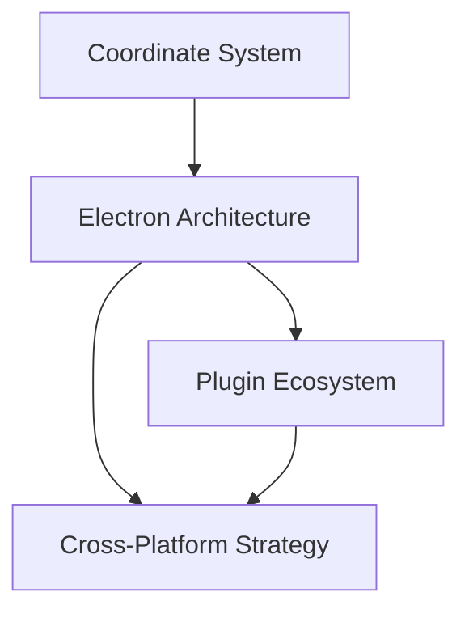

# Architecture Documentation

This folder contains fundamental architectural plans that define how the CNC control system is designed, structured, and integrated across different platforms and components.

## 📋 Documents Overview

### 🖥️ [Electron Architecture Plan](./electron-architecture-plan.md)
**Purpose**: Desktop application architecture using Electron framework  
**Key Features**:
- Multi-window application design
- IPC communication channels
- Native OS integration
- Security and performance optimization
- Menu systems and platform-specific features

**Implementation Timeline**: 4 weeks  
**Priority**: High (Foundation for desktop app)

---

### 🌐 [Cross-Platform Strategy Plan](./cross-platform-strategy-plan.md)
**Purpose**: Unified architecture for sharing logic between desktop and mobile platforms  
**Key Features**:
- Tauri + Capacitor recommended approach
- 95% code sharing between platforms
- Rust backend with TypeScript frontend
- Platform abstraction layer
- Monorepo development workflow

**Implementation Timeline**: 15 weeks  
**Priority**: Medium (Strategic expansion)

---

### 📐 [Coordinate System Management Plan](./coordinate-system-management-plan.md)
**Purpose**: Single source of truth for machine vs work coordinate systems  
**Key Features**:
- Unified coordinate manager
- Work Coordinate System (WCS) support
- Real-time UI synchronization
- Position transformation utilities
- Machine/work coordinate clarity

**Implementation Timeline**: 4 weeks  
**Priority**: Critical (Core CNC functionality)

---

### 🔌 [Plugin Ecosystem Plan](./plugin-ecosystem-plan.md)
**Purpose**: Extensible plugin architecture and community marketplace  
**Key Features**:
- Plugin framework with sandboxing
- Developer SDK and tools
- Community marketplace
- Third-party integrations
- Custom scripting engine

**Implementation Timeline**: 15 weeks  
**Priority**: Low (Extensibility feature)

## 🏗️ Architectural Principles

All architecture plans follow these core principles:

### Modularity
- Self-contained modules with clear APIs
- Dependency injection for testability
- Single responsibility principle

### Scalability
- Horizontal and vertical scaling support
- Resource optimization strategies
- Performance monitoring integration

### Security
- Security-by-design approach
- Principle of least privilege
- Comprehensive audit trails

### Maintainability
- Clear separation of concerns
- Comprehensive testing strategies
- Documentation-driven development

## 🔄 Integration Points

These architectural plans are designed to work together:

```
Cross-Platform Strategy
    ↓
Electron Architecture ←→ Plugin Ecosystem
    ↓                      ↓
Coordinate System ←→ Third-party Integrations
```

## 📊 Implementation Dependencies



## 🎯 Success Criteria

- **Electron Architecture**: Successful desktop app deployment
- **Cross-Platform**: 95% code sharing achievement
- **Coordinate System**: Zero position confusion incidents
- **Plugin Ecosystem**: 100+ community plugins within 6 months

## 📝 Next Steps

1. **Immediate**: Implement Coordinate System Management (Critical)
2. **Short-term**: Begin Electron Architecture implementation
3. **Medium-term**: Develop Plugin Ecosystem foundation
4. **Long-term**: Execute Cross-Platform Strategy

---

**Category Owner**: Architecture Team  
**Review Schedule**: Monthly  
**Last Updated**: June 2024