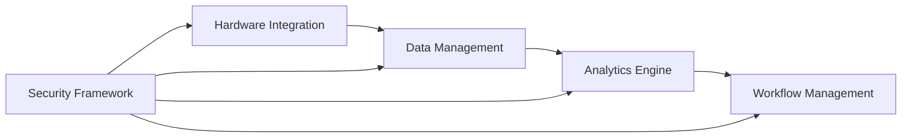

# Core Systems Documentation

This folder contains plans for essential system components that provide the foundational functionality for CNC machine control, safety, data management, and operational workflows.

## 📋 Documents Overview

### 🔒 [Security & Safety Framework Plan](./security-safety-framework-plan.md)
**Purpose**: Comprehensive security and safety systems for CNC operations  
**Key Features**:
- Emergency stop systems and fail-safes
- User authentication and access controls
- Command validation and safety boundaries
- Comprehensive audit trails and logging
- Real-time safety monitoring

**Implementation Timeline**: 10 weeks  
**Priority**: Critical (Safety-critical system)

---

### 📊 [Data Management & Analytics Plan](./data-management-analytics-plan.md)
**Purpose**: Data collection, analytics, and predictive maintenance systems  
**Key Features**:
- Real-time telemetry collection
- Job history and performance tracking
- Predictive maintenance algorithms
- Advanced analytics and machine learning
- Automated reporting and dashboards

**Implementation Timeline**: 15 weeks  
**Priority**: High (Operational intelligence)

---

### 🔧 [Hardware Integration Expansion Plan](./hardware-integration-expansion-plan.md)
**Purpose**: Extended hardware support including cameras, sensors, and auxiliary equipment  
**Key Features**:
- Camera and vision system integration
- Tool changer and spindle control
- Comprehensive sensor framework
- Safety system integration
- Material handling equipment

**Implementation Timeline**: 15 weeks  
**Priority**: High (Core functionality expansion)

---

### 📋 [Workflow Management Plan](./workflow-management-plan.md)
**Purpose**: CAM integration, job queuing, batch processing, and production scheduling  
**Key Features**:
- CAM software integration pipeline
- Advanced job queuing and batch processing
- Material management and optimization
- Production scheduling with AI
- ERP/MES system integration

**Implementation Timeline**: 15 weeks  
**Priority**: Medium (Production efficiency)

## ⚙️ System Integration

Core systems are designed to work together as an integrated platform:

```
Security & Safety Framework
    ↓ (Protects)
Data Management & Analytics ←→ Hardware Integration
    ↓ (Feeds)              ↗ (Monitors)
Workflow Management ←────────┘
```

## 🔄 Data Flow Architecture



## 🛡️ Safety-Critical Components

### Emergency Response Chain
1. **Hardware Integration** detects unsafe conditions
2. **Security Framework** validates and logs emergency actions
3. **Data Management** records incident data
4. **Workflow Management** manages recovery procedures

### Real-Time Monitoring
- Position tracking with safety boundaries
- Force and vibration monitoring
- Temperature and environmental sensing
- Communication health monitoring

## 📈 Performance Requirements

| System | Response Time | Uptime | Accuracy |
|--------|---------------|--------|----------|
| Security & Safety | <10ms | 99.99% | 100% |
| Data Management | <100ms | 99.9% | 99.5% |
| Hardware Integration | <50ms | 99.9% | 99.8% |
| Workflow Management | <2s | 99.5% | 99% |

## 🎯 Implementation Roadmap

### Phase 1: Foundation (Weeks 1-5)
- **Security Framework**: Core safety systems
- **Data Management**: Basic data collection
- **Hardware Integration**: Essential sensor support

### Phase 2: Integration (Weeks 6-10)
- **Security Framework**: Advanced authentication
- **Data Management**: Analytics engine
- **Hardware Integration**: Vision systems

### Phase 3: Optimization (Weeks 11-15)
- **Workflow Management**: Full implementation
- **All Systems**: Performance optimization
- **Integration Testing**: End-to-end validation

## 🔧 Technology Stack

### Common Technologies
- **Backend**: Rust for performance-critical components
- **Frontend**: TypeScript/React for user interfaces
- **Database**: Time-series DB for telemetry, PostgreSQL for structured data
- **Communication**: MQTT for real-time, REST for configuration
- **Security**: OAuth2/SAML for authentication, TLS for encryption

### System-Specific Technologies
- **Security**: Hardware security modules, biometric authentication
- **Data**: Apache Kafka for streaming, InfluxDB for time-series
- **Hardware**: Industrial communication protocols (Modbus, EtherNet/IP)
- **Workflow**: AI/ML frameworks for optimization

## 📊 Success Metrics

### Security & Safety
- Zero safety incidents due to software failures
- 100% emergency stop response reliability
- Full regulatory compliance achievement

### Data Management
- 99% data collection accuracy
- <2 second analytics query response
- 15% improvement in predictive maintenance accuracy

### Hardware Integration
- Support for 95% of common CNC peripherals
- 99.9% uptime for critical hardware systems
- <10ms response time for safety-critical systems

### Workflow Management
- 25% improvement in production throughput
- 90%+ machine utilization rates
- 95%+ on-time delivery performance

## 🚀 Getting Started

1. **Start with Security & Safety** - Foundation for all other systems
2. **Implement Data Management** - Enables monitoring and analytics
3. **Add Hardware Integration** - Expands system capabilities
4. **Deploy Workflow Management** - Optimizes operations

---

**Category Owner**: Core Systems Team  
**Review Schedule**: Bi-weekly during implementation  
**Last Updated**: June 2024