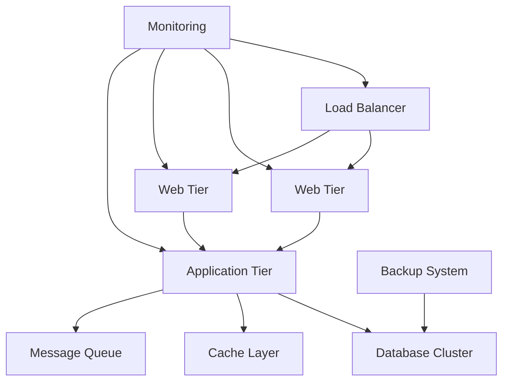
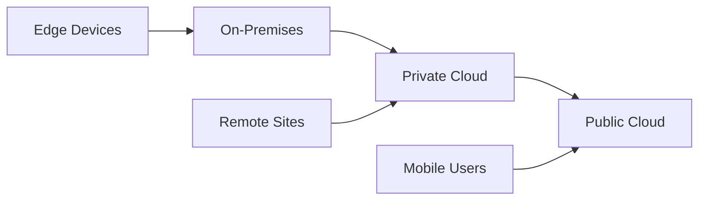
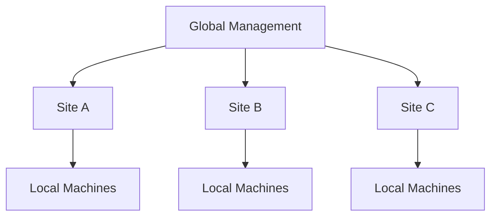

# Enterprise Features Documentation

This folder contains plans for advanced features designed for large-scale manufacturing environments, enterprise deployments, and multi-user collaborative workflows.

## 📋 Documents Overview

### 🏢 [Multi-User & Enterprise Plan](./multi-user-enterprise-plan.md)
**Purpose**: Comprehensive multi-user collaboration, fleet management, and enterprise integration  
**Key Features**:
- Advanced user management with role-based access control
- Real-time team collaboration and communication
- Fleet management for multiple CNC machines
- Cloud synchronization and remote access capabilities
- Enterprise analytics and business intelligence integration

**Implementation Timeline**: 15 weeks  
**Priority**: Strategic (Enterprise scalability and collaboration)

## 🏗️ Enterprise Architecture Philosophy

### Design Principles

#### 1. **Scalability First**
- Horizontal scaling for growing organizations
- Multi-tenant architecture support
- Resource optimization for large deployments
- Performance that scales with user count and data volume

#### 2. **Security & Compliance**
- Enterprise-grade security frameworks
- Compliance with industry standards (ISO 27001, SOC 2)
- Advanced audit trails and monitoring
- Data protection and privacy controls

#### 3. **Integration-Ready**
- API-first architecture for system integration
- Support for enterprise systems (ERP, MES, PLM)
- Flexible data exchange formats
- Real-time and batch integration patterns

#### 4. **Operational Excellence**
- 99.9% uptime requirements
- Comprehensive monitoring and alerting
- Automated backup and disaster recovery
- Performance optimization and tuning

## 🌐 Enterprise Deployment Models

### On-Premises Deployment

### Hybrid Cloud Deployment

### Multi-Site Federation

## 👥 User Management & Collaboration

### Organizational Hierarchy

#### User Roles & Permissions
- **Global Administrator**: Full system access across all sites
- **Site Administrator**: Site-specific administration
- **Production Manager**: Production oversight and scheduling
- **Quality Manager**: Quality control and compliance
- **Shift Supervisor**: Shift-level operations and team management
- **Senior Operator**: Advanced operations and training
- **Machine Operator**: Day-to-day machine operation
- **Viewer**: Read-only access for monitoring and reporting

#### Team Structure
- **Departments**: Manufacturing, Quality, Engineering, Maintenance
- **Shift Teams**: Rotating teams with handoff procedures
- **Project Teams**: Cross-functional teams for specific initiatives
- **Expert Networks**: Subject matter experts across the organization

### Collaboration Features

#### Real-Time Collaboration
- **Live Editing**: Simultaneous program editing with conflict resolution
- **Screen Sharing**: Remote assistance and training
- **Video Conferencing**: Integrated communication tools
- **Instant Messaging**: Context-aware messaging system

#### Knowledge Management
- **Shared Libraries**: Tool, program, and setup libraries
- **Best Practices**: Documented procedures and standards
- **Lessons Learned**: Captured knowledge from incidents and improvements
- **Training Materials**: Collaborative content development

## 🚀 Fleet Management Capabilities

### Multi-Machine Monitoring

#### Central Command Center
- **Real-Time Dashboard**: Status of all machines across facilities
- **Geographic View**: Site-based machine visualization
- **Alert Aggregation**: Centralized alert management
- **Performance Analytics**: Fleet-wide performance metrics

#### Resource Optimization
- **Load Balancing**: Intelligent job distribution across machines
- **Capacity Planning**: Predictive capacity analysis
- **Utilization Optimization**: Maximize fleet efficiency
- **Bottleneck Management**: Identify and resolve constraints

### Remote Management

#### Cloud Connectivity
- **Secure VPN**: Site-to-site connectivity
- **Edge Computing**: Local processing with cloud synchronization
- **Offline Capability**: Continued operation during connectivity issues
- **Data Synchronization**: Intelligent sync strategies

#### Mobile Access
- **Executive Dashboards**: High-level KPIs for leadership
- **Manager Tools**: Production oversight and decision support
- **Operator Apps**: Mobile job management and status updates
- **Maintenance Apps**: Work order management and documentation

## 📊 Enterprise Analytics & BI

### Business Intelligence Platform

#### Data Warehouse
- **Multi-Dimensional Analysis**: OLAP for complex queries
- **Historical Data**: Long-term trend analysis
- **Predictive Analytics**: Forecasting and scenario planning
- **Custom Reports**: User-defined reporting and dashboards

#### Key Performance Indicators
- **Overall Equipment Effectiveness (OEE)**: Manufacturing efficiency
- **Total Effective Equipment Performance (TEEP)**: Asset utilization
- **First Pass Yield**: Quality performance
- **Customer Satisfaction**: Service level metrics

### Advanced Analytics

#### Machine Learning Applications
- **Predictive Maintenance**: Failure prediction and prevention
- **Quality Optimization**: Process parameter optimization
- **Demand Forecasting**: Production planning optimization
- **Anomaly Detection**: Automated problem identification

#### Digital Twin Integration
- **Virtual Factory**: Digital representation of physical operations
- **Simulation**: What-if analysis and optimization
- **Real-Time Mirroring**: Live synchronization with physical systems
- **Optimization**: Continuous improvement through simulation

## 🔒 Enterprise Security Framework

### Security Architecture

#### Defense in Depth
- **Network Security**: Firewalls, VPN, network segmentation
- **Application Security**: Authentication, authorization, encryption
- **Data Security**: Encryption at rest and in transit
- **Endpoint Security**: Device management and protection

#### Compliance & Governance
- **ISO 27001**: Information security management
- **SOC 2**: Security, availability, and confidentiality
- **GDPR**: Data protection and privacy
- **Industry Standards**: Manufacturing-specific compliance

### Access Control

#### Identity Management
- **Single Sign-On (SSO)**: Centralized authentication
- **Multi-Factor Authentication (MFA)**: Enhanced security
- **Active Directory**: Enterprise directory integration
- **Role-Based Access Control (RBAC)**: Granular permissions

#### Audit & Compliance
- **Comprehensive Logging**: All user actions and system events
- **Real-Time Monitoring**: Security event detection
- **Compliance Reporting**: Automated compliance documentation
- **Incident Response**: Automated response to security events

## 📈 Success Metrics

### User Adoption & Engagement
- **User Adoption Rate**: 90%+ active user engagement
- **Collaboration Frequency**: 50% increase in team productivity
- **Training Completion**: 85% completion rate for onboarding
- **User Satisfaction**: 4.5/5 average satisfaction score

### Operational Excellence
- **System Uptime**: 99.9% availability
- **Performance**: <2 second response time for dashboards
- **Data Accuracy**: 99.9% data integrity
- **Security**: Zero security breaches

### Business Impact
- **Fleet Efficiency**: 25% improvement in overall equipment effectiveness
- **Cost Reduction**: 20% reduction in operational overhead
- **Quality Improvement**: 15% reduction in defect rates
- **Time to Market**: 30% faster product development cycles

## 🎯 Implementation Strategy

### Phase 1: Foundation (Weeks 1-5)
- **User Management**: Core authentication and authorization
- **Basic Fleet Monitoring**: Real-time machine status
- **Security Framework**: Essential security controls
- **Cloud Infrastructure**: Basic cloud deployment

### Phase 2: Collaboration (Weeks 6-10)
- **Real-Time Collaboration**: Live editing and communication
- **Advanced Fleet Management**: Resource optimization
- **Data Integration**: ERP/MES connectivity
- **Mobile Applications**: Basic mobile access

### Phase 3: Analytics (Weeks 11-15)
- **Business Intelligence**: Advanced analytics and reporting
- **Machine Learning**: Predictive capabilities
- **Optimization**: Performance and efficiency improvements
- **Advanced Security**: Enhanced compliance and governance

## 🚀 Getting Started

### For IT Leadership
1. Assess infrastructure requirements and capacity planning
2. Define security policies and compliance requirements
3. Plan integration with existing enterprise systems
4. Establish success metrics and monitoring strategies

### For Operations Management
1. Define organizational structure and role definitions
2. Plan change management and user adoption strategies
3. Identify key performance indicators and success metrics
4. Design workflow optimization and efficiency improvements

### For Development Teams
1. Implement multi-tenant architecture and scalability features
2. Build user management and collaboration capabilities
3. Develop fleet management and monitoring systems
4. Create analytics and business intelligence platforms

---

**Category Owner**: Enterprise Architecture Team  
**Review Schedule**: Quarterly strategic review, monthly progress assessment  
**Last Updated**: June 2024