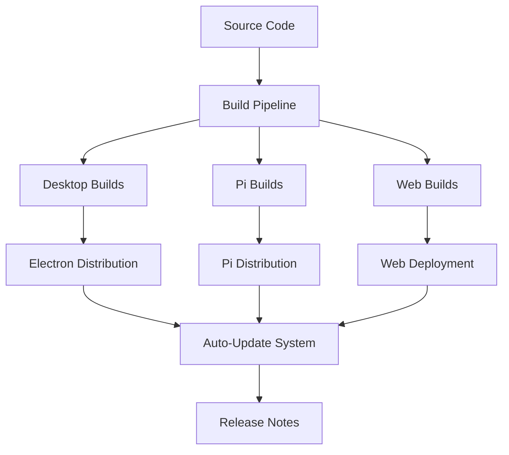

# Platform Deployment Documentation

This folder contains plans for deployment strategies, distribution methods, and update systems across different target platforms and hardware configurations.

## 📋 Documents Overview

### 🥧 [Raspberry Pi Distribution Plan](./raspberry-pi-distribution-plan.md)
**Purpose**: Optimized deployment strategy for Raspberry Pi hardware  
**Key Features**:
- Tauri + Pi Server hybrid architecture recommendation
- Performance analysis (Electron vs Tauri on Pi)
- Automated installation scripts
- Cross-compilation with GitHub Actions
- Pi-specific optimizations and configurations

**Implementation Timeline**: 10 weeks  
**Priority**: Strategic (Cost-effective deployment option)

---

### 🔄 [Auto-Update System Plan](./auto-update-system-plan.md)
**Purpose**: Automated update system with non-intrusive notifications  
**Key Features**:
- GitHub API integration for version checking
- Configurable polling with smart intervals
- Non-intrusive notification hierarchy
- Background downloads with progress tracking
- Rollback and safety verification

**Implementation Timeline**: 4 weeks  
**Priority**: High (Maintenance and deployment)

---

### 📝 [Release Notes System Plan](./release-notes-system-plan.md)
**Purpose**: Comprehensive release notes and update communication system  
**Key Features**:
- Structured release notes format
- Multi-source content retrieval (GitHub, CDN, bundled)
- Interactive release notes viewer
- Content categorization and filtering
- Analytics and user engagement tracking

**Implementation Timeline**: 10 weeks  
**Priority**: Medium (Communication and transparency)

## 🚀 Deployment Architecture

### Multi-Platform Strategy



### Platform Matrix

| Platform | Architecture | Distribution Method | Update Mechanism |
|----------|-------------|-------------------|------------------|
| Windows x64 | Electron | GitHub Releases | Auto-updater |
| macOS x64/ARM | Electron | GitHub Releases | Auto-updater |
| Linux x64 | Electron | GitHub Releases / AppImage | Auto-updater |
| Raspberry Pi | Tauri + Server | Custom Installer | Auto-updater |
| Web | React SPA | CDN | Cache Update |

## 🔧 Deployment Pipeline

### 1. Build & Packaging
- **Cross-compilation**: Automated builds for all target platforms
- **Optimization**: Platform-specific optimizations and configurations
- **Signing**: Code signing for security and trust
- **Testing**: Automated testing on target platforms

### 2. Distribution
- **GitHub Releases**: Primary distribution channel
- **CDN**: Fast global distribution for web assets
- **Pi Installer**: Custom installation package for Raspberry Pi
- **Enterprise**: Private distribution channels for enterprise customers

### 3. Update Management
- **Detection**: Smart polling with configurable intervals
- **Delivery**: Progressive download with bandwidth management
- **Installation**: Safe installation with rollback capability
- **Communication**: Rich release notes and change communication

## 🏗️ Infrastructure Requirements

### GitHub Actions CI/CD
```yaml
# Key workflows
- build-and-test.yml      # Continuous integration
- release-desktop.yml     # Desktop app releases
- release-pi.yml         # Raspberry Pi releases
- deploy-web.yml         # Web deployment
- update-release-notes.yml # Release notes generation
```

### CDN Configuration
- **Global Distribution**: Multiple edge locations
- **Caching Strategy**: Optimized for different content types
- **Security**: HTTPS, access controls, DDoS protection
- **Analytics**: Download metrics and user analytics

### Release Management
- **Semantic Versioning**: Automated version management
- **Staging Environment**: Pre-release testing
- **Rollout Strategy**: Gradual rollout with monitoring
- **Rollback Plan**: Quick rollback for critical issues

## 📊 Deployment Metrics

### Auto-Update System
- **Success Rate**: 99%+ successful updates
- **Performance**: <100ms UI impact for background checks
- **User Experience**: <5% notification dismissal rate
- **Safety**: 100% successful rollback rate on failures

### Release Notes System
- **Engagement**: >70% of users view release notes when prompted
- **Satisfaction**: >85% user satisfaction with release note clarity
- **Performance**: <2s load time for release notes content
- **Accessibility**: 100% compliance with WCAG 2.1 AA standards

### Raspberry Pi Distribution
- **Performance**: 50-70% better resource usage vs Electron
- **Reliability**: 99.9% uptime for Pi deployments
- **Installation**: 95% successful automated installations
- **Support**: <24h response for Pi-specific issues

## 🔒 Security Considerations

### Code Integrity
- **Code Signing**: All binaries signed with trusted certificates
- **Verification**: Automatic signature verification before installation
- **Checksum**: SHA-256 checksums for all downloads
- **Supply Chain**: Secure build pipeline with audit trails

### Update Security
- **Encrypted Transport**: All updates delivered over HTTPS
- **Authentication**: Authenticated update servers
- **Validation**: Pre-installation validation and testing
- **Sandboxing**: Update process runs in isolated environment

### Pi-Specific Security
- **Secure Boot**: Optional secure boot configuration
- **Network Security**: VPN and firewall recommendations
- **Access Control**: SSH key-based access only
- **Monitoring**: Security monitoring and alerting

## 🎯 Implementation Priority

### Phase 1: Foundation (Weeks 1-4)
1. **Auto-Update System** - Essential for maintenance
2. **Basic Pi Distribution** - Alternative deployment option

### Phase 2: Enhancement (Weeks 5-8)
3. **Release Notes System** - Improved communication
4. **Advanced Pi Features** - Full Pi optimization

### Phase 3: Optimization (Weeks 9-12)
5. **Performance Optimization** - All systems
6. **Enterprise Features** - Advanced deployment options

## 🚀 Getting Started

### For Developers
1. Review [Auto-Update System Plan](./auto-update-system-plan.md) for maintenance strategy
2. Study [Pi Distribution Plan](./raspberry-pi-distribution-plan.md) for alternative deployment
3. Implement [Release Notes System](./release-notes-system-plan.md) for communication

### For DevOps
1. Set up CI/CD pipelines based on platform requirements
2. Configure CDN and distribution infrastructure
3. Implement monitoring and alerting for deployment health

### For Product Management
1. Define rollout strategies and user communication
2. Plan feature flagging and gradual releases
3. Establish success metrics and monitoring dashboards

---

**Category Owner**: DevOps & Platform Team  
**Review Schedule**: Weekly during implementation, monthly maintenance  
**Last Updated**: June 2024