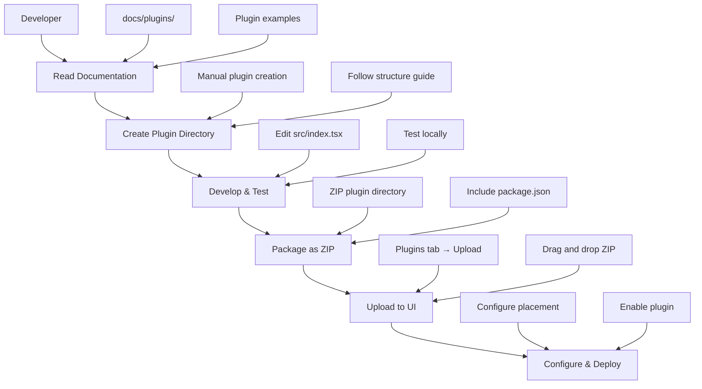
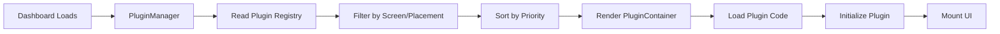

# Plugin Architecture Overview

This document provides a comprehensive overview of how the plugin system is organized, where components live, and how everything works together.

## 🏗️ System Architecture

### High-Level Overview

```
CNC Jog Controls Plugin Ecosystem
├── 🔧 Plugin Development Tools (CLI)
├── 📁 Plugin Storage Locations  
├── ⚙️ Plugin Management System
├── 🎨 UI Integration Layer
└── 📚 Documentation & Examples
```

## 📂 Directory Structure

### Complete Project Layout

```
electron-app/
├── docs/
│   └── plugins/                           # 📚 Plugin Documentation
│       ├── README.md                      # Main plugin development guide
│       ├── API-REFERENCE.md               # Complete API documentation
│       ├── GETTING-STARTED.md             # Quick start tutorial
│       ├── UI-PLACEMENT-GUIDE.md          # UI configuration guide
│       └── TROUBLESHOOTING.md             # Common issues and solutions
│
├── examples/
│   └── plugins/                           # 💡 Example Plugins
│       ├── machine-status-monitor/        # React/TypeScript example
│       └── gcode-snippets/                # Utility plugin example
│
├── docs/                                   # 📚 Documentation
│   └── plugins/                           # Plugin development guides
│
├── src/                                   # 🏠 Main Application
│   ├── components/
│   │   ├── PluginContainer.tsx            # Plugin loading component
│   │   ├── PluginManager.tsx              # Plugin registry and management
│   │   └── DeveloperTools/                # Developer tools UI
│   │       ├── DeveloperToolsCard.tsx
│   │       └── DeveloperToolsModal.tsx
│   │
│   ├── plugins/                           # 🔌 Integrated Plugins
│   │   └── my-first-plugin/               # Example integrated plugin
│   │       ├── src/index.js
│   │       ├── package.json
│   │       └── README.md
│   │
│   ├── views/Dashboard/
│   │   └── DashboardView.tsx              # Main dashboard with plugin integration
│   │
│   └── core/plugins/                      # 🧠 Core Plugin System (Advanced)
│       ├── core/
│       │   ├── PluginManager.ts           # Enterprise plugin manager
│       │   ├── PluginLoader.ts            # Plugin loading logic
│       │   ├── SecurityManager.ts         # Plugin security
│       │   └── APIGateway.ts              # Plugin API gateway
│       ├── registry/
│       │   └── PluginRegistry.ts          # Plugin discovery and registration
│       └── types/
│           └── plugin-types.ts            # TypeScript type definitions
│
# User plugins are now managed through the UI
│   └── [user-created-plugins]/            # Plugins created by users
│
├── create-plugin.sh                       # 🆕 Simple plugin creator
├── package.json                           # Main app dependencies
└── README.md                              # Project overview
```

## 🔄 Plugin Lifecycle & Data Flow

### 1. Plugin Development Workflow



### 2. Plugin Loading Process



## 🔧 Development Approach

### UI-Based Plugin Development

**Approach**: Integrated plugin management through the main application UI
**Installation**: No additional setup required
**Access**: Built into the Plugins tab

```bash
# Modern approach - everything through the UI:
# Plugin creation: Manual development following documentation guides
# Plugin management: Integrated UI in the Plugins tab
# API documentation: Generated automatically from TypeScript interfaces
# Marketplace: Browse and install through Marketplace tab
# Registry: Publish and sync through Registry tab
```

## 📁 Plugin Management (UI-Based System)

### 1. Plugin Development
```
my-awesome-plugin/             # 👤 USER DEVELOPMENT (External)
├── package.json              # Plugin manifest with dependencies
├── README.md                 # Documentation
├── icon.png                  # Plugin icon (optional)
├── src/
│   ├── index.tsx             # Main React component
│   └── components/           # Additional components
└── assets/                   # Static assets
```
- **Purpose**: Plugin development and testing
- **Created by**: Manual development following the plugin guide
- **Access**: ZIP upload through UI

### 2. Application Integration
```
# Plugins are managed internally by the UI system
# No manual file management required
# All plugins loaded through the PluginContext service
```
- **Purpose**: Runtime plugin management
- **Created by**: UI upload and configuration system
- **Access**: Managed through Plugins tab interface

### 3. Plugin Documentation & Examples
```
docs/plugins/                  # 📚 DOCUMENTATION
├── getting-started/          # Development tutorials
├── api-reference/            # API documentation
└── MARKETPLACE-INTEGRATION.md # UI system guide
```
- **Purpose**: Learning and reference for plugin development
- **Created by**: Project maintainers
- **Access**: Documentation for developers

## ⚙️ Plugin Management System

### Frontend Components

**PluginContainer** (`src/components/PluginContainer.tsx`)
- Loads and renders individual plugins
- Handles ES modules and CommonJS plugins
- Provides mock API for development
- Applies UI configuration (size, placement)

**PluginManager** (`src/components/PluginManager.tsx`)
- Maintains plugin registry
- Handles plugin enable/disable
- Renders plugins based on screen and placement
- Sorts plugins by priority

**DashboardView** (`src/views/Dashboard/DashboardView.tsx`)
- Main integration point
- Uses `renderPluginsForScreen()` for dynamic plugin placement
- Responsive grid layout with Ant Design

### Backend/Core System (Advanced)

**Enterprise Plugin Manager** (`src/core/plugins/core/PluginManager.ts`)
- Full-featured plugin orchestration
- Dependency resolution
- Security validation
- Health monitoring
- Event-driven architecture

## 🎨 UI Integration Layers

### 1. Simple Integration (Current)
```typescript
// Dashboard automatically renders plugins
{renderPluginsForScreen('main', 'dashboard')}
```

### 2. Manual Integration
```typescript
// Direct plugin placement
<PluginContainer 
  pluginPath="/src/plugins/my-plugin/src/index.js"
  pluginName="my-plugin"
  uiConfig={{ placement: 'dashboard', size: { width: 12 } }}
/>
```

### 3. Advanced Integration (Enterprise)
```typescript
// Full plugin manager with registry
<PluginManager 
  registry={pluginRegistry}
  securityLevel="high"
  sandboxed={true}
/>
```

## 📋 Plugin Configuration

### Plugin Manifest (package.json)
```json
{
  "name": "my-plugin",
  "cncPlugin": {
    "apiVersion": "1.0.0",
    "category": "utility",
    "displayName": "My Plugin",
    "permissions": ["machine.status.read"],
    "ui": {
      "placement": "dashboard",     // Where it appears
      "screen": "main",            // Which screen
      "size": { "width": 12 },     // Grid sizing
      "priority": 100              // Display order
    }
  }
}
```

### Plugin Implementation
```javascript
class MyPlugin {
  constructor(api) {
    this.api = api  // CNC Jog Controls API
  }
  
  async initialize() { /* Setup */ }
  async mount(container) { /* Render UI */ }
  async unmount() { /* Cleanup */ }
  async destroy() { /* Final cleanup */ }
}
```

## 🚀 Plugin Distribution (UI-Based System)

### Development Phase
1. **Local Development**: Create plugin directory with React components
2. **Testing**: Package as ZIP and upload through Plugins tab
3. **Iteration**: Reload plugin through UI, instant feedback

### Sharing Phase
1. **GitHub**: Share plugin directory as repository
2. **Download**: Others download and create their own ZIP
3. **Installation**: Upload ZIP through UI with visual configuration

### Marketplace Integration (Implemented)
1. **Publish**: Use Registry tab to publish to connected registries
2. **Discover**: Browse Marketplace tab with search and filtering
3. **Install**: One-click installation with dependency resolution

## 🔍 Key Design Principles

### 1. **Developer Experience First**
- Simple plugin creation with manual directory setup
- UI-based plugin management with visual configuration
- Instant feedback through drag-and-drop upload

### 2. **Multiple Complexity Levels**
- **Simple**: JavaScript plugins with basic API
- **Advanced**: TypeScript plugins with full tooling
- **Enterprise**: Full plugin manager with security

### 3. **Self-Contained Ecosystem**
- No external dependencies required
- All tools work offline
- Everything runs locally

### 4. **Future-Proof Architecture**
- Ready for marketplace integration
- Supports both simple and complex plugins
- Extensible UI placement system

## 📞 How Components Communicate

### Plugin ↔ Application
```javascript
// Plugin receives API object
const api = {
  events: { on, off, emit },      // Event system
  machine: { getStatus, sendCommand }, // Machine control
  logger: { info, error, debug }, // Logging
  storage: { get, set }           // Data persistence
}
```

### UI ↔ Plugin System
```typescript
// React components use plugin manager
import { renderPluginsForScreen } from '../components/PluginManager'

// Renders all plugins for a specific screen/placement
{renderPluginsForScreen('main', 'dashboard')}
```

### UI-Based Plugin Management
```typescript
// UI system manages plugins through the PluginContext
import { usePlugins } from '../services/plugin'

// Upload, configure, and manage plugins visually
const { plugins, updatePlugin, installPlugin } = usePlugins()
```

This architecture provides a complete, self-contained plugin ecosystem that grows with your needs - from simple scripts to enterprise-grade plugin management! 🎯