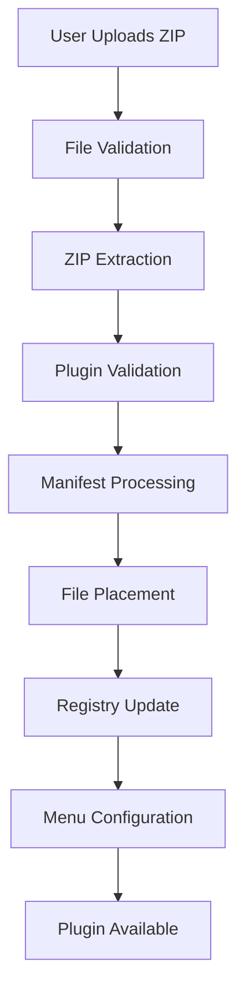

# Plugin Upload System - Complete Guide

## 🚀 Overview

The CNC Jog Controls Plugin Upload System provides a user-friendly way to install and configure plugins directly from the application interface. Users can upload ZIP files containing plugins and visually configure where and how they appear in the application.

## 📋 Features

### ✅ What's Implemented

1. **Visual Upload Interface** - Drag-and-drop ZIP file upload with validation
2. **Placement Configuration** - GUI for setting screen, size, priority, and positioning
3. **Menu Integration** - Automatically add plugins to application menus
4. **Plugin Registry** - Centralized management of installed plugins
5. **Auto-Installation** - ZIP extraction, validation, and file placement
6. **Configuration Management** - Visual forms for all plugin settings

### 🔧 Core Components

| Component | Location | Purpose |
|-----------|----------|---------|
| **PluginUploader** | `src/components/PluginUploader.tsx` | Main upload interface |
| **PluginUploadService** | `src/services/pluginUploadService.ts` | Backend processing logic |
| **Plugin Registry** | `src/config/plugin-registry.json` | Plugin database |
| **Menu Config** | `src/config/menu-config.json` | Menu integration settings |
| **Developer Tools** | `src/components/DeveloperTools/` | UI integration point |

## 🎯 How to Use

### Step 1: Access Upload Interface
1. Go to **Dashboard**
2. Find **Developer Tools** card
3. Click **"Upload Plugin"** button
4. Plugin Upload System opens in modal

### Step 2: Upload Plugin ZIP
1. **Select ZIP File**: Click "Select Plugin ZIP File" or drag-and-drop
2. **File Validation**: System checks file type and size (< 10MB)
3. **Structure Check**: Validates plugin structure and manifest

### Step 3: Configure Placement

#### UI Placement Options
| Setting | Options | Description |
|---------|---------|-------------|
| **Placement Type** | Dashboard, Standalone, Modal, Sidebar, Controls, Machine, Workspace | Where plugin UI appears |
| **Target Screen** | Main, New, Controls, Machine, Workspace, Settings | Which application screen |
| **Width** | 6, 12, 18, 24 columns or Auto | Grid column span |
| **Height** | 200px, 300px, 400px, 500px or Auto | Fixed height or content-fit |
| **Priority** | 1-200 | Display order (higher = first) |

#### Menu Integration
- **Enable Menu**: Add plugin to application menu
- **Menu Path**: Hierarchical path (e.g., "Tools/My Plugins/Plugin Name")
- **Icon**: Ant Design icon (ToolOutlined, SettingOutlined, etc.)
- **Shortcut**: Keyboard shortcut (e.g., "Ctrl+Shift+P")

#### Plugin Settings
- **Enable Plugin**: Turn plugin on/off
- **Auto-start**: Start plugin when application loads
- **Permissions**: Plugin API access rights

### Step 4: Installation
1. Click **"Install Plugin"**
2. System processes upload:
   - ✅ Extracts ZIP file
   - ✅ Validates plugin structure
   - ✅ Places files in `src/plugins/`
   - ✅ Updates plugin registry
   - ✅ Configures UI placement
   - ✅ Adds menu items (if enabled)
3. **Success**: Plugin appears immediately on configured screen

## 📂 Plugin Structure Requirements

### Required Files
```
my-plugin.zip
├── package.json          # Plugin manifest (required)
├── src/
│   └── index.js          # Main plugin file (required)
├── README.md             # Documentation (recommended)
└── [other files]         # Assets, styles, etc.
```

### Package.json Format
```json
{
  "name": "my-plugin",
  "version": "1.0.0",
  "description": "My awesome plugin",
  "main": "src/index.js",
  "cncPlugin": {
    "apiVersion": "1.0.0",
    "category": "utility",
    "displayName": "My Awesome Plugin",
    "description": "Does something amazing",
    "permissions": ["machine.status.read"]
  }
}
```

### Plugin Implementation
```javascript
class MyPlugin {
  constructor(api) {
    this.api = api
    this.name = 'my-plugin'
  }
  
  async initialize() {
    // Setup code
  }
  
  async mount(container) {
    // Render UI in container
    container.innerHTML = '<div>Hello World!</div>'
  }
  
  async unmount() {
    // Cleanup
  }
  
  async destroy() {
    // Final cleanup
  }
}

export default MyPlugin
```

## ⚙️ System Architecture

### Upload Flow


### File Organization
```
src/
├── plugins/                    # Installed plugins
│   ├── my-plugin/             # User uploaded plugin
│   │   ├── package.json       # Updated with UI config
│   │   ├── src/index.js       # Plugin implementation
│   │   └── README.md          # Plugin documentation
│   └── another-plugin/        # Another installed plugin
│
├── config/
│   ├── plugin-registry.json   # Plugin database
│   └── menu-config.json       # Menu configuration
│
└── components/
    ├── PluginUploader.tsx      # Upload interface
    ├── PluginContainer.tsx     # Plugin loader
    └── PluginManager.tsx       # Plugin management
```

## 🔧 Configuration System

### Plugin Registry Entry
```json
{
  "id": "my-plugin",
  "name": "My Awesome Plugin",
  "version": "1.0.0",
  "description": "Does something amazing",
  "category": "utility",
  "enabled": true,
  "autoStart": true,
  "installedAt": "2024-06-30T20:00:00.000Z",
  "path": "../plugins/my-plugin/src/index.js",
  "manifest": { /* full package.json */ },
  "config": {
    "placement": "dashboard",
    "screen": "main",
    "size": { "width": 12, "height": "auto" },
    "priority": 100,
    "menuIntegration": {
      "enabled": true,
      "menuPath": ["Tools", "My Plugins", "My Plugin"],
      "icon": "ToolOutlined",
      "shortcut": "Ctrl+Shift+M"
    },
    "enabled": true,
    "autoStart": true,
    "permissions": ["machine.status.read"]
  }
}
```

### Menu Configuration
```json
{
  "pluginMenus": [
    {
      "pluginId": "my-plugin",
      "path": ["Tools", "My Plugins", "My Plugin"],
      "icon": "ToolOutlined",
      "shortcut": "Ctrl+Shift+M",
      "enabled": true
    }
  ]
}
```

## 🎨 Placement Examples

### Dashboard Widget (Small)
```json
{
  "placement": "dashboard",
  "screen": "main",
  "size": { "width": 6, "height": 200 },
  "priority": 75
}
```

### Full-Width Status Panel
```json
{
  "placement": "dashboard",
  "screen": "machine", 
  "size": { "width": 24, "height": "auto" },
  "priority": 150
}
```

### Standalone Application
```json
{
  "placement": "standalone",
  "screen": "new",
  "size": { "width": "auto", "height": "auto" },
  "priority": 100,
  "menuIntegration": {
    "enabled": true,
    "menuPath": ["Tools", "My Apps", "Plugin Name"],
    "shortcut": "Ctrl+Shift+P"
  }
}
```

### Control Panel Integration
```json
{
  "placement": "controls",
  "screen": "controls",
  "size": { "width": 8, "height": 150 },
  "priority": 120
}
```

## 🚦 Plugin Lifecycle

### 1. **Upload Phase**
- File validation and extraction
- Plugin structure verification
- Manifest processing

### 2. **Installation Phase**
- File placement in `src/plugins/`
- Registry entry creation
- Menu configuration update

### 3. **Runtime Phase**
- Plugin loading via PluginContainer
- UI rendering based on placement config
- API integration and event handling

### 4. **Management Phase**
- Enable/disable via registry
- Configuration updates
- Uninstallation and cleanup

## 🔍 Troubleshooting

### Common Issues

**Upload Fails**
- Check ZIP file structure has package.json
- Ensure main file (index.js) exists
- Verify file size < 10MB

**Plugin Doesn't Appear**
- Check placement/screen configuration
- Verify plugin is enabled in registry
- Check browser console for errors

**Menu Item Missing**
- Ensure menuIntegration.enabled = true
- Check menu path format
- Verify menu configuration update

**Plugin Errors**
- Check plugin implementation exports
- Verify API usage is correct
- Check browser console for details

## 🔮 Future Enhancements

### Planned Features
1. **Plugin Store Integration** - Browse and install from marketplace
2. **Update Management** - Version control and automatic updates
3. **Dependency Resolution** - Handle plugin dependencies
4. **Sandboxing** - Security isolation for plugins
5. **Hot Reload** - Live plugin updates during development
6. **Plugin Templates** - Pre-built plugin scaffolds

### Technical Improvements
1. **Real File System** - Replace mock system with actual file operations
2. **Validation Engine** - Enhanced plugin security and validation
3. **Performance Monitoring** - Plugin resource usage tracking
4. **Backup System** - Plugin configuration backup/restore
5. **API Gateway** - Centralized plugin API management

## 🎯 Summary

The Plugin Upload System transforms CNC Jog Controls into a truly extensible platform where users can:

- **Easily install plugins** via visual interface
- **Configure placement** without code changes  
- **Manage plugins** through centralized registry
- **Integrate with menus** automatically
- **Share plugins** as simple ZIP files

This system bridges the gap between plugin development and user adoption, making the entire ecosystem more accessible and user-friendly! 🚀