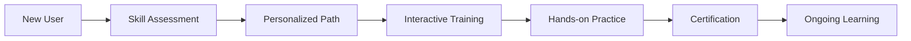
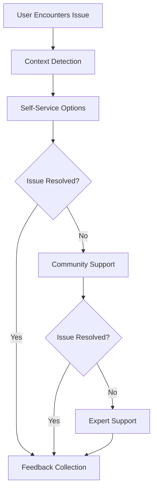

# User Experience Documentation

This folder contains plans for user-facing features that enhance usability, learning, and support for CNC machine operators and engineers.

## 📋 Documents Overview

### 🎓 [Training & Support System Plan](./training-support-system-plan.md)
**Purpose**: Comprehensive training, support, and help system for CNC users  
**Key Features**:
- Interactive onboarding with skill assessment
- Context-sensitive help system
- Intelligent diagnostic and troubleshooting tools
- Community platform with expert networks
- User-generated content and knowledge sharing

**Implementation Timeline**: 15 weeks  
**Priority**: Medium (Critical for user adoption and success)

## 🎯 User Experience Philosophy

### Design Principles

#### 1. **Progressive Disclosure**
- Present information at the right time and complexity level
- Allow users to dive deeper when needed
- Avoid overwhelming beginners while empowering experts

#### 2. **Context Awareness**
- Provide help that's relevant to current task and user state
- Anticipate user needs based on actions and patterns
- Reduce cognitive load through smart defaults

#### 3. **Learning-Oriented**
- Transform every interaction into a learning opportunity
- Build confidence through guided practice and feedback
- Support continuous skill development

#### 4. **Community-Driven**
- Leverage collective knowledge and experience
- Enable peer-to-peer learning and support
- Foster a culture of knowledge sharing

## 🚀 User Journey Framework

### Onboarding Journey

### Support Journey

## 🎓 Learning & Development Framework

### Competency Model

#### Skill Levels
1. **Novice** (0-6 months experience)
   - Basic safety procedures
   - Simple machine operation
   - Guided task execution

2. **Beginner** (6-18 months experience)
   - Independent basic operations
   - Simple programming tasks
   - Problem recognition

3. **Intermediate** (1.5-3 years experience)
   - Complex programming
   - Setup optimization
   - Basic troubleshooting

4. **Advanced** (3-7 years experience)
   - Process optimization
   - Advanced programming
   - Training others

5. **Expert** (7+ years experience)
   - System design
   - Innovation and improvement
   - Mentoring and leadership

### Learning Pathways

#### Operator Track
- **Safety Fundamentals** (Mandatory)
- **Machine Operation Basics**
- **Quality Control Procedures**
- **Routine Maintenance**
- **Advanced Operations**

#### Programmer Track
- **CNC Programming Fundamentals**
- **CAM Integration**
- **Optimization Techniques**
- **Advanced Features**
- **Process Engineering**

#### Supervisor Track
- **Leadership and Management**
- **Production Planning**
- **Quality Management**
- **Team Development**
- **Continuous Improvement**

## 🛠️ Support System Architecture

### Help System Layers

#### 1. **Contextual Assistance**
- Tooltips and overlays
- Interactive tutorials
- Smart suggestions
- Real-time guidance

#### 2. **Self-Service Resources**
- Searchable knowledge base
- Video tutorials
- Troubleshooting wizards
- FAQ and common solutions

#### 3. **Community Support**
- Peer-to-peer forums
- Expert consultation
- User-generated content
- Best practice sharing

#### 4. **Professional Support**
- Technical support tickets
- Remote assistance
- Training services
- Consulting and optimization

### Diagnostic & Troubleshooting

#### Problem Detection
- **Automatic**: System monitors for anomalies and issues
- **User-Reported**: Guided problem reporting with context
- **Predictive**: Machine learning predicts potential issues

#### Solution Delivery
- **Guided Workflows**: Step-by-step problem resolution
- **Visual Instructions**: Video and image-based guidance
- **Interactive Demos**: Safe simulation environment for learning
- **Expert Connection**: Direct access to subject matter experts

## 📊 User Experience Metrics

### Learning Effectiveness
- **Completion Rate**: 90% for onboarding modules
- **Knowledge Retention**: 85% score on follow-up assessments
- **Time to Competency**: 30% reduction in learning curve
- **Certification Rate**: 75% of users achieve basic certification

### Support Effectiveness
- **Self-Service Success**: 70% of issues resolved without escalation
- **First Contact Resolution**: 85% of support tickets resolved immediately
- **User Satisfaction**: 4.5/5 average rating for support experience
- **Response Time**: <2 hours for critical issues, <24 hours for standard

### Community Engagement
- **Active Participation**: 40% of users contribute to community
- **Content Quality**: 4.2/5 average rating for user-generated content
- **Knowledge Sharing**: 60% of solutions come from community
- **Expert Network**: 95% of expert consultations rated as helpful

## 🔄 Continuous Improvement

### Feedback Loops

#### User Feedback
- **In-App Ratings**: Quick feedback on features and content
- **Usage Analytics**: Understanding how users interact with the system
- **Surveys**: Regular user satisfaction and needs assessment
- **Focus Groups**: Deep dive into user experience challenges

#### Content Optimization
- **A/B Testing**: Test different approaches to training and support
- **Analytics-Driven**: Use data to identify content gaps and opportunities
- **Community Curation**: Leverage community expertise for content improvement
- **Expert Review**: Regular review by subject matter experts

### Personalization Engine

#### Adaptive Learning
- **AI-Powered Recommendations**: Suggest relevant content based on user behavior
- **Difficulty Adjustment**: Automatically adjust complexity based on user performance
- **Learning Style Adaptation**: Support different learning preferences
- **Career Path Guidance**: Recommend next steps based on role and goals

#### Context Awareness
- **Role-Based Content**: Filter and prioritize content based on user role
- **Machine-Specific Help**: Provide help relevant to specific machine configurations
- **Skill-Level Appropriate**: Present information at appropriate complexity level
- **History-Informed**: Learn from past interactions to improve future assistance

## 🎯 Implementation Roadmap

### Phase 1: Foundation (Weeks 1-5)
- **Core Training Framework**: Basic onboarding and assessment
- **Help System Infrastructure**: Context detection and content delivery
- **Community Platform**: Basic forum and knowledge base

### Phase 2: Enhancement (Weeks 6-10)
- **Interactive Training**: Simulation and hands-on practice
- **Advanced Help Features**: AI-powered assistance and smart search
- **Diagnostic Tools**: Automated problem detection and guided troubleshooting

### Phase 3: Optimization (Weeks 11-15)
- **Personalization**: Adaptive learning and content recommendations
- **Community Features**: Expert networks and user-generated content
- **Analytics & Insights**: Advanced learning analytics and optimization

## 🚀 Getting Started

### For Product Managers
1. Define user personas and journey maps
2. Establish success metrics and measurement framework
3. Plan phased rollout with user feedback integration

### For UX Designers
1. Review user experience principles and design patterns
2. Create wireframes and prototypes for key user flows
3. Design accessible and inclusive user interfaces

### For Developers
1. Implement core training and help system infrastructure
2. Build context-aware assistance features
3. Integrate community platform and user-generated content

### For Content Creators
1. Develop comprehensive training curriculum
2. Create multimedia learning resources
3. Build knowledge base and troubleshooting guides

---

**Category Owner**: User Experience Team  
**Review Schedule**: Weekly user feedback review, monthly UX assessment  
**Last Updated**: June 2024